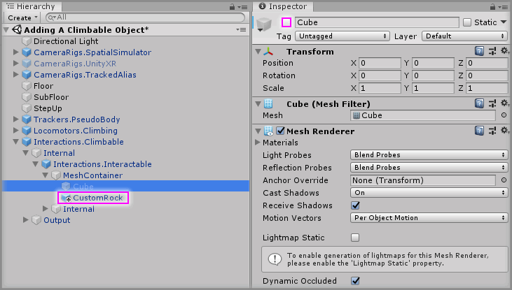

# Adding A Climbable Object

> * Level: Beginner
>
> * Reading Time: 5 minutes
>
> * Checked with: Unity 2018.3.14f1

## Introduction

The ability to climb up objects is a fun and freeing locomotion in virtual reality and this mechanic can be easily created using a customized interactable prefab to handle the climbing action along with the pseudo body prefab to handle the physics of the user's body.

## Prerequisites

* [Add the Tilia.Trackers.PseudoBody.Unity -> Trackers.PseudoBody] prefab to the scene hierarchy.
* [Add the Tilia.Interactions.Interactables.Unity -> Interactions.Interactor] prefab to the scene hierarchy.
* [Install the Tilia.Locomotors.Climbing.Unity] package dependency in to your [Unity] project.

## Let's Start

### Step 1

First off, make sure you start with the [Adding A PseudoBody] guide to be sure you're working from that scene as a base for this guide. Then go through the [Adding An Interactor] guide and use this guide to add interactors to the scene you've created in the [Adding A PseudoBody] guide. When it's all done, you should have a Unity scene hierarchy like so:

### Step 2

We're now ready to set up the required prefabs for climbing. First off we need to add the climbing controller that communicates with the PseudoBody.

Add a `Locomotors.Climbing` prefab to the Unity project hierarchy by selecting `GameObject -> Tilia -> Prefabs -> Locomotors -> Climbing -> Locomotors.Climbing` from the Unity main top menu.

### Step 3

We now need to tell this new Climbing controller about the PseudoBody in the scene so our climbing mechanic can apply world physics on our body.

Drag and drop the `Trackers.PseudoBody` GameObject into the `Pseudo Body Facade` property on the `Pseudo Body Climb Target` component on the `Locomotors.Climbing` GameObject.

### Step 4

Next is to add a special interactable object that can be grabbed by an interactor but will work as the basis of our climbable object.

Add a `Interactions.Climbable` prefab to the Unity project hierarchy by selecting `GameObject -> Tilia -> Prefabs -> Interactions -> Interactables -> Interactions.Climbable` from the Unity main top menu.

### Step 5

Our `Interactions.Climbable` GameObject is a simple cube by default, the same as any base interactable. We can change the mesh and colliders by delving into the prefab, but for now we'll just keep the cube and reposition/resize to match the `Block` GameObject. We can also just delete the existing `Block` GameObject as we are going to replace that end wall with this climbable wall.

Select the `Interactions.Climbable` GameObject from the Unity Hierarchy and on the `Transform` component change the Transform properties to:

* Position: `X = 0, Y = -3, Z = 7`
* Scale: `X = 3, Y = 3, Z = 3`

### Step 6

We're almost ready to have a climbable wall, we just need to hook up our Climbing controller to our Climable Interactable and our simple climbable should be ready.

Drag and drop the `Locomotors.Climbing` GameObject into the `Climbing Facade` property on the `Climbable Facade` component on the `Interactions.Climable` GameObject.

### Step 7

Play the Unity scene and walk up to the new climbable wall, reach out with one of your hands and grab the wall. You'll now notice that you can lift yourself up the wall as if you were climbing.

### Step 8

The one thing you will find is if you try and pull yourself into the wall then you won't be able to pull yourself through the wall due to the `SolveBodyCollisions` that was set up on the PseudoBody component, but also if you do try and pull yourself through the wall you'll end up just letting go of the grab and falling down.

This is because the `Interactions.Climable` prefab is set up by default to release the grab of the climbable object if the interactor stops touching the collider.

We can sort this by delving into the `Interactions.Climable` prefab and toggling off an event listener.

Select the `Interactions.Climable -> Internal -> Interactions.Interactable` GameObject from the Unity Hierarchy window and on the `Interactable Facade` component change the `Untouched` event listener from `RunTime Only` to `Off` on the `UngrabOnUntouch` GameObject for the `InteractorAttachPointExtractor.DoExtract` method.

> This turns off the event listener from being called by the `Untouched` event so it won't ungrab when we stop touching.

### Step 9

As mentioned earlier, we can change the mesh and colliders of our climbable object in the same way we'd change the mesh of any Interactable GameObject.

Select the `Interactions.Climable -> Internal -> Interactions.Interactable` GameObject from the Unity Hierarchy window and on the `Interactable Facade` component click the `Show Mesh Container` button to expose the inner GameObjects that contain the mesh and collider data for our climbable.

Now we can see inside the mesh container is just a simple cube GameObject, we can disable that GameObject and add our own mesh in making sure it has a set of colliders to go along with it.

> Remember that mesh colliders don't work well for continuous collisions, but if you must use a mesh collider then make sure it is a `convex` mesh collider.

### Done

Play the Unity scene and you will be able to climb up the custom mesh along with not being able to pull yourself through the rock but without letting go automatically.

[Add the Tilia.Trackers.PseudoBody.Unity -> Trackers.PseudoBody]: https://github.com/ExtendRealityLtd/Tilia.Trackers.PseudoBody.Unity/tree/master/Documentation/HowToGuides/AddingAPseudoBody/README.md
[Adding A PseudoBody]: https://github.com/ExtendRealityLtd/Tilia.Trackers.PseudoBody.Unity/tree/master/Documentation/HowToGuides/AddingAPseudoBody/README.md
[Add the Tilia.Interactions.Interactables.Unity -> Interactions.Interactor]: https://github.com/ExtendRealityLtd/Tilia.Interactions.Interactables.Unity/tree/master/Documentation/HowToGuides/AddingAnInteractor/README.md
[Adding An Interactor]: https://github.com/ExtendRealityLtd/Tilia.Interactions.Interactables.Unity/tree/master/Documentation/HowToGuides/AddingAnInteractor/README.md
[Install the Tilia.Locomotors.Climbing.Unity]: ../Installation/README.md 
[Unity]: https://unity3d.com/